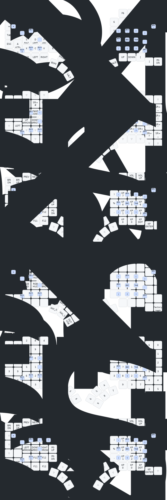

# MoErgo Glove80 Custom Configuration for ZMK

My custom configuration for glove80

- use the compile script to compile and the ufo file will be in a new `combined` folder

- to modify the keymap, if you want a ui you can use this webpage https://nickcoutsos.github.io/keymap-editor/

## upload firmware

1. in the magic layer press ` esc` for the right half, `quote` for the left half 
2. copy glove80.uf2 into the usb mass storage
3. the half will just reboot
4. do the other half

## the keymap cheatsheet

